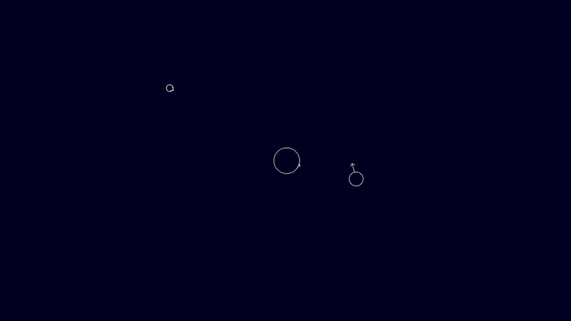

# Simple Gravity Simulator

A simple 2D gravity simulator written in pure C.

* Simple physics simulator of bodies in motion using Newton's Universal Law of Gravitation
* Uses SDL2 to render
* Just Mac specific for now. Adjusting the makefile should make it crossplatform though.

## Plans
* Add 3D support
* Add debug with force/acceleration, and velocity vectors rendered on screen

