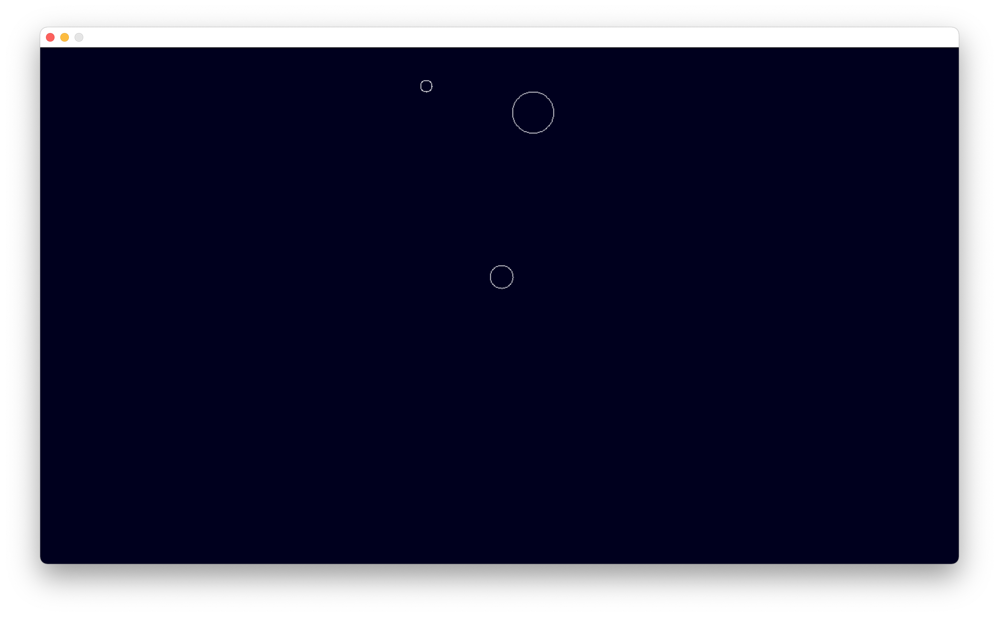

# Simple Gravity Simulator

A simple 2D gravity simulator (will add 3D once I get things working properly in 2D) writting in pure C.

* Simple physics simulator of bodies in motion using Newton's Universal Law of Gravitation
* Uses SDL2 to render
* Just Mac specific for now. Adjusting the makefile should make it crossplatform though.

